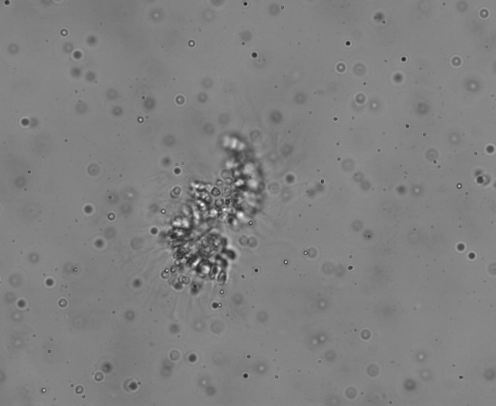
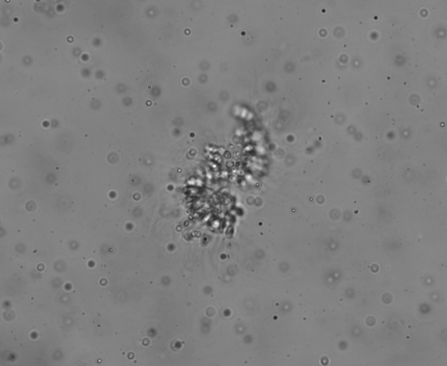

# choanotrack
Track and re-render microscopic choanoflagellate colonies based on masks created in LaVision DaVis.
Generalizable for tracking similar microscopic footage.
 


# Requirements
* Python ~3.9.6 (lvreader is not compatible with python >= 3.10)
* lvreader == 1.1.0 (Not available on pypi. Distributed by [LaVision](https://www.lavision.de/en/)). This code was developed with lvreader-1.1.0-cp39-cp39-win_amd64.whl
* imageio >= 2.14.1
* numpy >= 1.22.1
* scikit-image >= 0.19.1
* pandas >= 1.4.0
* tqdm

# Install
Use Python poetry for package installation or manually install packages listed in `pyproject.toml`.
Before installation, move `lvreader-1.1.0-cp39-cp39-win_amd64.whl` to root of this directory.
In case you are using a different version of lvreader (e.g., Linux version), you will want to manually install to avoid conflicts with poetry lock file.

# Usage
## Tracking colonies
```
python ./choanotrack/track.py [-h] [--input INPUT] [--output OUTPUT] [--start START] [--end END] [--filter FILTER] [--wn WN]

Track colonies using LaVision mask files

optional arguments:
  -h, --help            show this help message and exit
  --input INPUT, -i INPUT
                        input path to .set file
  --output OUTPUT, -o OUTPUT
                        output path. Defaults to ./output.csv
  --start START, -s START
                        starting frame. Defaults to 0
  --end END, -e END     end frame. defaults to -1
  --filter FILTER, -f FILTER
                        Butterworth filter order. Defaults to 4.
  --wn WN, -w WN        Butterworth filter critical frequency. Defaults to 0.12
```
Note that two csv files are created:
output_raw.csv contains raw data of all frames
output_filt_start_S_end_E.csv contains smoothed data within specified start and end frames.

Output csv contains the following fields:
```
properties = [
    "frame",                 # frame number of source video
    "timestamp_s",           # time stamp of source
    "area_px2",              # area of mask (colony) in pixel space
    "bbox_y_min_px",         # min y value of bounding box
    "bbox_y_max_px",         # max y value of bounding box
    "bbox_x_min_px",         # min x value of bounding box
    "bbox_x_max_px",         # max x value of bounding box
    "major_axis_length_px",  # length of major axis of ellipse fitted to colony
    "minor_axis_length_px",  # length of minor axis
    "centroid_y_px",         # y coordinate centroid
    "centroid_x_px",         # x coordinate centroid
    "scale_um_px",           # microns per pixel scale
    "eccentricity",          # eccentricity of fitted ellipse. 0 = circle
    "orientation_rad",       # angle between y axis and major axis (-pi/2 to pi/2)
    "rotation_rad_s",        # rate of angular rotation
    "area_um2",              # area of colony in micron space
    "major_axis_length_um",  # length in um
    "minor_axis_length_um",  # length in um
    "centroid_y_um",         # centroid in um
    "centroid_x_um",         # centroid in um
    "velocity_y_um_s",       # y-component magnitude in micron space
    "velocity_x_um_s",       # x-component magnitude in micron space
    "velocity_mag_um_s",     # magnitude of velocity
    "velocity_angle_rad",    # angle of velocity
]
```

## Centering and unspinning colonies
```
python ./choanotrack/centerize.py [-h] [--video_in VIDEO_IN] [--csv_in CSV_IN] [--output OUTPUT] [--bottom_pad BOTTOM_PAD] [--fill FILL] [--rotate ROTATE]

Create new image stack centered on colony

optional arguments:
  -h, --help            show this help message and exit
  --video_in VIDEO_IN, -v VIDEO_IN
                        input path to video
  --csv_in CSV_IN, -c CSV_IN
                        Input path to csv with colony data
  --output OUTPUT, -o OUTPUT
                        Path to output directory. Defaults to ./output/
  --bottom_pad BOTTOM_PAD, -b BOTTOM_PAD
                        number of pad pixels on bottom of video to remove. Defaults to 20
  --fill FILL, -f FILL  grayscale value to fill background of centered images. Defaults to 255
  --rotate ROTATE, -r ROTATE
                        rotate images based on changes in colony orientation. Defaults to True
```


# to be continued